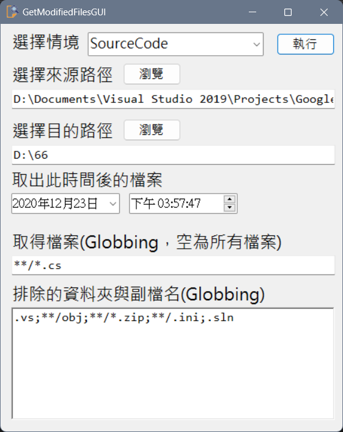

為了取得新增或有異動的檔案並依照原目錄架構  
GUI版可以切換模式可能比較方便??  
\
20221223  
\* framewok 4.5 => 4.6.2(Win10)  
% 修改為Globbing排除(using Microsoft.Extensions.FileSystemGlobbing)  
\+ 增加取得檔案欄位  
% 改進介面與ini檔格式  
! 修改一些低級錯誤  

